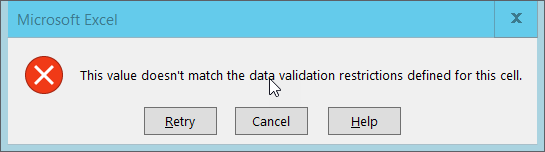
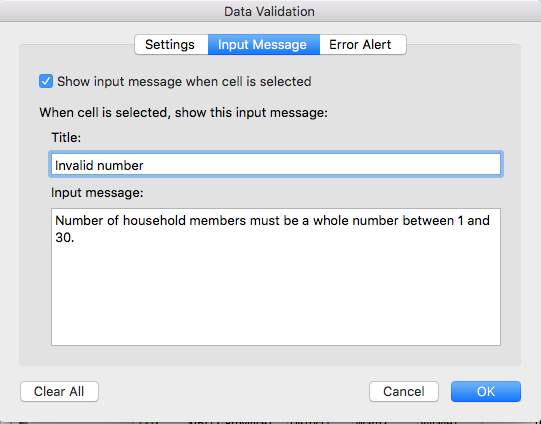
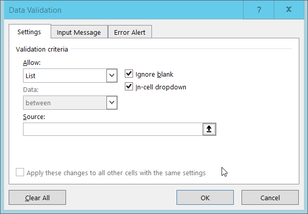

When you have a well-structured data table, you can use several simple
techniques within your spreadsheet to ensure the data you enter is
free of errors. 

## Validating data on input

When we input data into a cell of a spreadsheet we are typically not constrained in the type of data we enter.
In any one column, the spreadsheets software will not warn us if we start to enter a mix of text, numbers or dates in different rows.
Even if we are not facing constraints from the software, as a researcher we often anticipate that all data in one column will be of a certain type.
It is also possible that the nature of the data contained in the table allows us place additional restrictions on the acceptable values for cells in a column.
For example a column recording age should be numeric, greater than 0 and is unlikely to be greater than 120.

Excel allows us to specify a variety of data validations to be applied to cell contents.
If the validation fails an error is raised and the data we entered does not go into the particular cell.
In addition to providing validation when we enter data, Excel allows us to add validations to data that has already been entered.
The validation is not applied retrospectively, so that data are removed.
Instead, if a particular cell would fail the validation check a triangle is placed in the top left corner of the cell as a warning.

We will be working with a couple of examples of data validation
rules but many others exist. For an overview of data validation rules
available in Excel, check out the [Excel support page on data validation](https://support.office.com/en-us/article/Apply-data-validation-to-cells-29FECBCC-D1B9-42C1-9D76-EFF3CE5F7249). 

We will look at two examples: 

1. Restricting data to a numeric range
2. Restricting data to entries from a list

### Restricting data to a numeric range

Looking again at the [clean version of the SAFI
dataset](https://ndownloader.figshare.com/files/11492171), we see that there are
several columns with numeric data. One example of this is the column `no_membrs`
representing the number of people in the household. We would expect this always
to be a positive integer, and so we should reject values like `1.5` and `-8` as
entry errors. We would also reject values over a certain maximum - for example
an entry like `90` is probably the result of the researcher inputting `9` and
their finger slipping and also hitting the `0` key. It is up to you as the
researcher to decide what a reasonable maximum value would be for your data,
here we will assume that there are no families with greater than 30 members.

1\. Select the `no_membrs` column.

2\. On the `Data` tab select `Data Tools` and then `Data Validation` or `Validation Tools` (depending on your version of Excel). The following popout will appear: 

3\. Select 'Whole number' from the `Allow` drop down options.

4\. The window content will change.
The value in the data box will say 'between' and `Minimum` and `Maximum` boxes will be provided for you to specify an allowed range.

5\. Fill in the minimum and maximum values that make sense for your data and click `Ok`. Here we will choose a minimum of 1 and a maximum of 30.

Your data table will now not allow you to enter a value that violates
the data validation rule you have created. To test this out, try 
to enter a new value into the `num_membrs` column that is not valid.
The following error box will appear: 

You can also customize the resulting message to be more informative by entering
your own message in the `Input Message` tab when creating a data validation rule.

or allow invalid data to result in a warning rather than an error by modifying the `Style`
option on the `Error Alert` tab.

> ## Exercise
> Apply a new data validation rule to one of the other numeric 
> columns in this data table. Discuss with the person sitting next
> to you what a reasonable rule would be for the column you've selected. Be sure to create an informative input message. 
{: .challenge}

### Restricting data to entries from a list

Quality assurance can make data entry easier as well as more robust. For
example, if you use a list of options to restrict data entry, the spreadsheet
will provide you with a drop-downlist of the available items. So, instead of
trying to remember how to spell "mabatisloping", or whether or not you capitalized "cement" you can select the
right option from the list.

1\. Select the `respondent_wall_type` column.

2\. On the `Data` tab select `Data Tools` and then `Data Validation` or `Validation Tools` (depending on your version of Excel). The following popout will appear: 

3\. Select `List` from the `Allow` drop-down menu.

4\. The window will change to include a `Source` box.

5\. Type a list of all the values that you want to be accepted in this column, separated by commas. For us this will be "grass, muddaub, burntbricks, sunbricks, cement". 

6\. Create a meaningful input message, then click OK.

We have now provided a restriction that will be validated each time we try and
enter data into the selected cells. When a cell in this column is selected, a drop-down arrow will appear.
When you click the arrow you will be able to select a value from your list.
If you type a value which is not on the list you will get an error message. This not only prevents data input errors, but also makes it easier and faster to enter data. 

> ## Exercise
> Apply a new data validation rule to one of the other categorical 
> columns in this data table. Discuss with the person sitting next
> to you what a reasonable rule would be for the column you've selected. Be sure to create an informative input message. 
{: .challenge}

> ## Tip
> Typing a list of values where only a few possible values exist (like "grass, muddaub, burntbricks, sunbricks, cement") might be convenient, but if the list is longer it makes sense to create it as a small table (in a separate tab of the workbook).
> We can give the table a name and then reference the table name as the source of acceptable inputs when the source box appears in the Data Validation pop-out.
>
> Using a table in this way makes the data entry process more flexible.
> If you add or remove contents from the table, then these are immediately reflected in any new cell entries based on this source.
> You can also have different cells refer to the same table of acceptable inputs.
{: .callout}

> ## Tip
> 
> In the examples above we have applied data validation rules to
> an existing spreadsheet to demonstrate how they work, however, 
> you may have noticed that data validation rules are not applied
> retroactively to data that is already present in the cell. 
> This means, for example, that if we had already entered `150`
> in the `num_membrs` column before applying our data validation
> rule, that cell would not be flagged with a warning. 
> 
> When using spreadsheets for data entry, it is a good idea to set up
> data validation rules for each column when you set up your 
> spreadsheet (i.e. before you enter any data). 
{: .callout}


