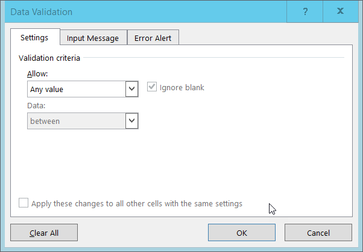
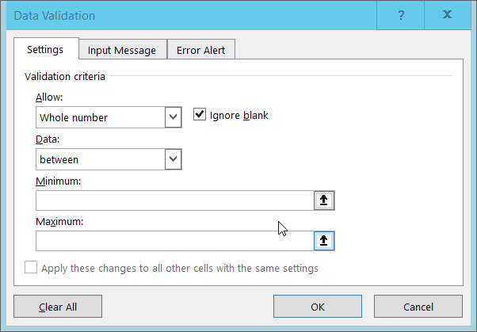

## Validating data on input

When we input data into a cell of a spreadsheet we are typically not constrained in the type of data we enter.
In any one column, the spreadsheets software will not warn us if we start to enter a mix of text, numbers or dates in different rows.
Even if we are not facing constraints from the software, as a researcher we often anticipate that all data in one column will be of a certain type.
It is also possible that the nature of the data contained in the table allows us place additional restrictions on the acceptable values for cells in a column.
For example a column recording age should be numeric, greater than 0 and is unlikely to be greater than 120.

Excel allows us to specify a variety of data validations to be applied to cell contents.
If the validation fails an error is raised and the data we entered does not go into the particular cell.
In addition to providing validation when we enter data, Excel allows us to add validations to data that has already been entered.
The validation is not applied retrospectively, so that data are removed.
Instead, if a partcular cell would fail the validation check a green triangle is placed in the top left corner of the cell as a warning.

Details of the different types of validation possible and how to set them up are available [here](https://support.office.com/en-us/article/Apply-data-validation-to-cells-29FECBCC-D1B9-42C1-9D76-EFF3CE5F7249)

In what follows, we will look at two examples:

1. Restricting data to a numeric range
2. Restricting data to entries from a list

### Restricting data to a numeric range

When we want to restrict data in some cells to be *numeric* we proceed as follows:

1. Select the cell or cells where the restriction applies.
2. Go to the Data tab, find the Data Tools section and select 'Validation Tools.' The following popout will appear:

    

3. Select 'Whole number' from the Allow drop down options.
4. The window content will change.
    The value in the data box will say 'between' and Min and Max boxes will be provided for you to specify a range.

    

5. Fill in the min and max values as you like and click OK.

We have now provided a restriction.
To test it out, go to one of the cells where we set the restriction to apply.
If you enter a value that is withing the allowed range, your input will be accepted and written into the cell.
If you enter a value outside the chosen range, the following error box will appear:

### Restrict data to entries from a list

1. Select the cell or cells where the restriction applies.
2. Go to the Data tab, find the Data Tools section and select 'Validation Tools.' The following popout will appear:

    

3. Select 'List' from the Allow drop-down menu.
4. The window will change to include a Source box.

    

5. Type a comma separated list of values that you want to be acceptable values.
    Then click OK.

We have now provided a restriction that will be validated each time we try and
enter data into the selected cells.
The cells will now have a drop-down arrow against it (when the cell is selected).
When you click the arrow you will be able to select a value from your list.
If you type a value which is not on the list you will get an error message.

> ## Tip
> Typing a list of values for simple choices like True and False or Red, Amber, Green might be convenient, but if the list is longer it makes sense to create the it as a small table (in a separate tab of the workbook).
> We can give the table a name and then reference the table name as the source of acceptable inputs when the source box appears in the Data Validation pop-out.
>
> Using a table in this way makes the data entry process more flexible.
> If you add or remove contents from the table, then these are immediately reflected in any *New* cell entries based on this source.
> You can also have different cells refer to the same table of acceptable inputs.
{: .callout}

## Creating tables for data entry

The data validation functionality of Excel is a very powerful way of reducing erroneous data being entered into your data table.

You may have spotted a slight flaw in the plan though.

> ## Discussion
>
> What makes the processes described above somewhat impractical?
>
> > ## Solution
> >
> > The validation needs to be applied to each cell or cells in advance. Instead of selecting individual cells, you can select a complete column. Even if the first row contains a column name, as the validation is not applied retrospectively, this will not cause a problem.
> {: .solution}
{: .discussion}

A better way to apply data validation on data entry is to create a proper data table in Excel.

To do this;

1. In the top row of an empty worksheet type in the column names for your data, in the order in which you expect to enter them.
2. On the next row select the cell in the column for which you wish to apply data validation.
3. Set up the appropriate validation for this cell.
4. Repeat the validation step for all cells in the second row whose columns  you wish to apply data validation to.
5. Select a cell in the row where the column names are entered.
6. Go to the Insert menu, go to the Tables Section and select 'Table.'

    

5. Check the box 'My table has header' and extend the size of the table from one row to two by changing the last 1 to a 2. Then click OK.
6. A table will be created with your column headings and a single blank row beneath them.
7. You can enter data into this blank row. Any cell which has data validation set up for it will be restricted using with the data validation you set up.
8. When you have entered data into the last column of the table and hit the Tab key, a new row of the table will be created and the cursor will be placed in the first column of it.
9. In this new row and all subsequent rows added to the table, the data validation for all of the columns originally set up with data validation will be repeated.

> ## Tip: The Excel Data Entry form
>
> In older versions of Excel there was a data entry form which allowed you to input single records (rows of data) by completing a pop-up form.
> This is still available but  does not appear on the default menu and toolbars.
> The basic functionality of inserting rows is essentially superseded by the use of defined tables and entering data directly into them as we have done in steps 7 and 8 above.
> The above method has the advantage of stopping data entry as soon as you try to place invalid data in a cell covered by a data validation rule.
>
> In the old Data entry form the data validation rules were only checked when a compiled record was being inserted.
{: .callout}
