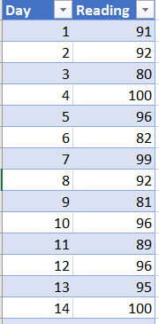

## Spreadsheet storage formats

Excel and other spreadsheet applications store the data in their own proprietary formats. 
This is fine if you only intend to use the data in the same application that it was created in, but it
can make it difficult to open the spreadsheet files in other applications that you may want to use to 
process the data.

In future versions of Excel Microsoft may make changes to the format, so that existing files are not even readable by the latest versions of Excel.

The .xlsx format used by versions of Excel since 2007 is in fact a folder of compressed XML files. 
You can rename a .xlsx file as a .zip file and extract the individual files. 
Amongst other things there will be an XML file for each of the tabs in your spreadsheet.

You could load this XML file into a text editor and read the data in it. But XML is a very verbose data format, designed originally for 
transferring data between one computer application and another. You may be able to read it but it would not be in the nice tabular format
that you see when it is loaded into Excel.

If you tried to load the .xlsx file directly into a text editor, the result would be gibberish as the text editor 
would simply try to display the characters in the compressed data file.

> ## Exercise
> 
> 1. Copy an .xlsx file and rename it as a .zip file.
> 
>    Extract the folders/files form the .zip file.
> 
>    Find the XML file corresponding to one of the tabs in the spreadsheet and open it in any text editor.
> 
>    Can you find the spreadsheet data in it? How easy would it be to use in this format?
> 2. Try opening a .xlsx file directly into a Text editor. 
> 
>    Can you find the spreadsheet data in it? How easy would it be to use in this format?
{: .challenge}

## Saving spreadsheet data as a csv file

CSV  stands for Comma Seperated Values. As the name suggests data items are stored seperated by commas. 
If there is a header row, then this is stored in the same way.
This makes a .csv file not only human readable, but it is a format that can also be read by any other data or 
statistical analysis applications such as Stata or SPSS.
It is also very easy to read .csv files in programming languages like Python or R.

This makes CSV an almost univeral portable format. 

> ## Exercise
> 1. create an Excel spreadsheet with the following data in it 
> 
> 
> 
> 2. Save the spreadsheet as a .csv file using
>    File | Save as   and select .csv fromm  the drop down box for the filetype.
> 
> 3. Load the file back into Excel by double-clicking the filename. Does the data look the same as it was?
> 
> 4. Open the .csv file in a text editor. What does the data look like?
> 
> > ## Solution
> > 
> > 1. When the .csv file created from the .xlsx file in Excel is opened it looks just as it did when it was saved.
> > 2. When you open the file in a text editor you will see that the data from cell  cell B4 has been placed in quotes.
> >    Excel does this automatically as it detected that the data included a comma. 
> > 
> > Most applications will ignore commas in quoted strings when reading a .csv file, but it is not guaranteed. 
> > It is also not guaranteed that an application writing a csv file will put strings in quotes if there are commas.
> > 
> > If commas are causing problems an alternative to csv is tsv. 't' stands for Tab. Instead of commas seperating the values, the Tab character is used.
> > All applications that will save as a csv file will also allow you to save as a tsv file.
> > 
> > A tsv file has an additional advantage in that when you load it into a text editor, the editor interprets the Tab characters, so all of the columns will
> > line up with their column names.
> {: .solution}
{: .challenge}

## Saving filenames with the spreadsheet data

Normally the data that we are interested in is contained within the spreadsheet. However it is possible that the name 
of the spreadsheet file also contains data that we are interested in.

Supposing you had a set of files containing daily instrument readings from some system. 
There is a seperate file for each month of each year. The files are named 'Month_yyyy_readings.xlsx'. 
If you wanted to combine all of the files together, it would be convenient to include the filename information as part of the data,
so that when combined you would have complete date information in each row of the combined file.

The spreadsheet called August_2017_readings.xlsx has only two columns; Day and Reading. It can be downloaded from [here](../data/August_2017_readings.xlsx).

We want to create a new column to include the filename.

We can add a new column, give it the name of 'Full_Filename_and_sheet' and in the cells below add the formula 

~~~
=CELL("filename")
~~~

CELL is an Excel built in function which can be used to return various different pieces of information one of which is the filename
of the spreadsheet. In fact as our column name suggest, it gives not only the full path of the file but also the tab name as well.

If we just want the filename, then we can extract it from the full name with another formula; 

~~~
=RIGHT(LEFT(A2,FIND("]",A2) - 1),LEN(LEFT(A2,FIND("]",A2) - 1))-FIND("[",A2))
~~~

A2 is the cell with the full path and tab name. 

If you wanted the Tab name by itself, you could use the formula 

~~~
=RIGHT(A2,LEN(A2)-FIND("]",A2))
~~~

A copy of the spreadsheet with these modifications is available [here](../data/August_2017_readings_sol.xlsx)

> ## Exercise
> 
> Rather than using the CELL function to get the path and filename and then using this result to extract just the file name into a seperate column, write a formula which will do these actions as a single step.
> 
> Use the August_2017_readings_sol.xlsx file as the starting point.
> 
> > ## Solution
> > 
> > In our original formula to extract the the filename, we referenced the cell A2 which contained the result of the CELL("filename") function. To combine the two we only need to replace all of the references of 'A2' with 'CELL("filename") in the formula for extracting the filename.
> > 
> > ~~~
> > =RIGHT(LEFT(CELL("filename"),FIND("]",CELL("filename")) - 1),LEN(LEFT(CELL("filename"),FIND("]",CELL("filename")) - 1))-FIND("[",CELL("filename")))'
> > ~~~
> >
> > If you get #VALUE returned, it is most likely that you have not saved the spreadsheet and given it a name.
> {: .solution}
{: .challenge}

