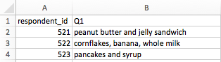

Storing the data you're going to work with for your analyses in Excel
default file format (`*.xls` or `*.xlsx` - depending on the Excel
version) isn't a good idea. Why?

- Because it is a proprietary format, and it is possible that in
the future, technology won’t exist (or will become sufficiently
rare) to make it inconvenient, if not impossible, to open the file.

- Other spreadsheet software may not be able to open files
saved in a proprietary Excel format.

- Different versions of Excel may handle data
differently, leading to inconsistencies.

- Finally, more journals and grant agencies are requiring you
to deposit your data in a data repository, and most of them don't
accept Excel format. It needs to be in one of the formats
discussed below.

- The above points also apply to other formats such as open data formats used by LibreOffice / Open Office. These formats are not static and do not get parsed the same way by different software packages.

As an example of inconsistencies in data storage, do you remember how we talked about how Excel stores dates earlier? It turns out that 
there are multiple defaults for different versions of the software, and you can switch between them all. So, say you’re
compiling Excel-stored data from multiple sources. There’s dates in each file- Excel interprets them as their own internally consistent
serial numbers. When you combine the data, Excel will take the serial number from the place you’re importing it from, and interpret it
using the rule set for the version of Excel you’re using. Essentially, you could be adding errors to your data, and it wouldn’t
necessarily be flagged by any data cleaning methods if your ranges overlap.

Storing data in a universal, open, and static format will help deal with this problem. Try tab-delimited (tab separated values
or TSV) or comma-delimited (comma separated values or CSV). CSV files are plain text files where the columns are separated by commas,
hence 'comma separated values' or CSV. The advantage of a CSV file over an Excel/SPSS/etc. file is that we can open and read a CSV file
using just about any software, including plain text editors like TextEdit or NotePad. 
Data in a CSV file can also be easily imported into other formats and
environments, such as SQLite and R. We're not tied to a certain version of a certain expensive program when we work with CSV files, so
it's a
good format to work with for maximum portability and endurance. Most spreadsheet programs can save to delimited text formats like CSV
easily, although they may give you a warning during the file export.

To save a file you have opened in Excel in CSV format:

1. From the top menu select 'File' and 'Save as'.
2. In the 'Format' field, from the list, select 'Comma Separated Values' (`*.csv`).
3. Double check the file name and the location where you want to save it and hit 'Save'.

An important note for backwards compatibility: you can open CSV files in Excel!

> ## Exercise
> 1. create an Excel spreadsheet with the following data in it 
> 
> 
> 
> 2. Save the spreadsheet as a .csv file using
>    File | Save as   and select .csv fromm  the drop down box for the filetype.
> 
> 3. Load the file back into Excel by double-clicking the filename. Does the data look the same as it was?
> 
> 4. Open the .csv file in a text editor. What does the data look like?
> 
> > ## Solution
> > 
> > 1. When the .csv file created from the .xlsx file in Excel is opened it looks just as it did when it was saved.
> > 2. When you open the file in a text editor you will see that the data from cell  cell B3 has been placed in quotes.
> >    Excel does this automatically as it detected that the data included at least one comma. 
> > 
> > Most applications will ignore commas in quoted strings when reading a .csv file, but it is not guaranteed. 
> > It is also not guaranteed that an application writing a csv file will put strings in quotes if there are commas.
> > 
> > If commas are causing problems an alternative to csv is tsv. 't' stands for Tab. Instead of commas seperating the values, the Tab character is used.
> > All applications that will save as a csv file will also allow you to save as a tsv file.
> > 
> > A tsv file has an additional advantage in that when you load it into a text editor, the editor interprets the Tab characters, so all of the columns will
> > line up with their column names.
> {: .solution}
{: .challenge}

