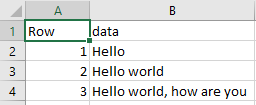

## Spreadsheets outline

In this lesson, we’re going to talk about:

- Using best practice to create your own data tables in spreadsheets
- Reformatting existing spreadsheets (using Excel)
- Recognising and reformatting dates in spreadsheets
- Basic quality control; using data validation and Data entry forms (in Excel)
- Exporting data from spreadsheets

### Spreadsheet programs

Many spreadsheet programs are available. We will use Microsoft Excel in our examples.
Although it is not open source software it is very widely available and used.

Free spreadsheet programs such as LibreOffice and OpenOffice are available.
The functionality of these may differ from Excel, but in general they can be used to perform similar tasks.

## Problems with Spreadsheets

Spreadsheets are good for data entry,
    but in reality we tend to use spreadsheet programs for much more than data entry.
We use them to create data tables for publications,
    to generate summary statistics,
    and make figures.
Laying out spreadsheets in this way often adds some difficulty when we want
    to take our data from the spreadsheet and use it in another program.
Additional white space, merged cells, colour and grids
    may aid readability but are not easily handled by other programs
    that take our spreadsheet as an input to further analysis.

Generating statistics and figures in spreadsheets, should be done with caution.
The graphical, drag and drop nature of spreadsheet programs means that it can be very difficult, if not impossible, to replicate your steps (much less retrace anyone else’s).
This is particularly true if your stats or figures require complex calculations.
Furthermore, when performing calculations in a spreadsheet, it’s easy to accidentally apply a slightly different formula to multiple adjacent cells.
This often makes it to demonstrate data quality and consistency in our analysis.

Even when we are aware of some of the limitations that data in spreadsheets presents,
    often we have inherited spreadsheets from another colleague or data provider.
In these situations we cannot exercise any control in its construction
    or entry of the data within it.
Nevertheless it is important to be aware of the limitations these data may present, and know how to assess if any problems are present and how to overcome them.

> ## Tip
> * In the next episode we will look at how you may be able to deal with some of these problems by re-formatting the data.
> * In later sections we discuss using the functionality of Excel to make data entry easier and reduce the number of errors.
{: .callout}

We finish this section by outlining some best practices for the creation of data tables within a spreadsheet.

## Creating a spreadsheet to hold data

When we usually think of 'data', our mind often thinks of information
    contained in tables.
Within this table, we think of columns representing variables
    and the rows representing observations.
Spreadsheets are very good at recording data in this way.

Once we have data organized this way, it is easy to get drawn into adding
    additional information and/or styling to our data.
This is often due to us wanting to make the data simpler to understand and
    the amount of functionality modern spreadsheet software provide.
In a sense, the more additional information we add to the table or data,
    the more our data begin to look like a set of notes.
Typical additions we make to data include:

* The use of colour codes to indicate values
* Adding multiple tables in a single sheet
* Inconsistently defined values for variables, or inconsitent variable naming conventions
* Introduction of white space and the merging of cells - to make it look more readable

You can set things up in different ways in spreadsheets -
    often incorporating many of these points from above.
However, some of these choices can limit your ability to
    work with the data in other programs or
    have the you-of-6-months-from-now or your collaborator work with the data.
We advocate keeping spreadsheet contents to be a simple table design,
    with the rows and columns following the guidelines for Tidy data as indicated by Hadley Wickham in his paper ['Tidy Data'](https://www.jstatsoft.org/article/view/v059i10).

## The simple guidelines

The following guidelines offer advice on how to keep spreadsheets as simple as possible:

1. One table per spreadsheet (or one per spreadsheet tab) at most
2. Start in cell A1
3. First row is for column names
4. No spaces in column names
5. Only a single variable in each column
6. Use a consistent format for the column values. i.e. don't mix date formats, consistency when representing boolean values
7. One observation per row.
8. Static data columns first, then measured or recorded data columns then calculated columns
9. Keep formulas simple

## More detailed guidelines

Often, spreadsheets we come across are more elaborate, and contain more than data values.
We often come across spreadsheets where some columns are the result of complex
    formulas combining other columns of data and applying transformations to them.
Despite the convenience and ease with which we can work this way,
    spreadsheets are not ideal for these purposes.
This is because there is a the lack of an audit trail of what has been done
in the drag and drop, point and click environment in which these more elaborate spreasheets are often constructed.

For more complex spreadsheets there are additional best practices available
    to make them not only more readable but also more maintainable.
[Twenty principles for good spreadsheet practice](http://www.icaew.com/~/media/corporate/files/technical/information%20technology/excel%20community/166%20twenty%20principles%20for%20good%20spreadsheet%20practice.ashx)
from the ICAEW has some useful further advice.

Always remember, the more complex the spreadsheet, the more likely that it will contain errors.
Googling 'Spreadsheet Errors' or more specifically 'Reinhart and Rogoff' will allow you to investigate how bad things can get.
