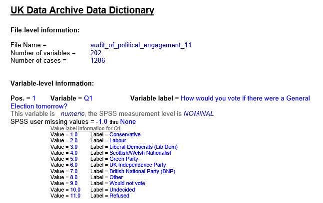

## Data formatting problems

In the report spreadsheet example, it was not the actual data that was the problem, it was the way it was laid out 
in the spreadsheet.

In this episode we will consider how the data itself can cause problems. 
We have alluded to some of the possibilities in the guidelines in the first section

## Exercise 
> 
> Have a look at the spreadsheet [here](../data/SAFI_results_2.xlsx) and
> see how many potential problems you can identify.
> 
> > ## Solution
> > 
> > 1. **Multiple tables should be avoided.** Using multiple tables in this way makes it difficult to export the data for use elsewhere. The same arguement applies to using multiple tabs in a spreadsheet. It is likely that the tab name would contain data relevant to the table in the tab. This will be lost if you export the data from the tab.
> > 
> > 2. **Missing values.** If you inherit the dataset then you may be stuck with missing values. If you are entering the data yourself, make sure that all cells have an entry. If you do not have a value for the cell you should consider uing 'NULL' to indicate this. Do not be tempted to assume default values like 0 for a numeric value or "" (the empty string) for a missing text value. There will be circumstances when 0 and "" have significance and you risk corrupting your analysis.
> > 
> > 3. **Using comments.** You can use comments if appropriate or relevant, but they should occupy their own column in the table. Do not use the built-in commenting features of the spreadsheet as the information will be loset when you export. Do not use a '*' or other character as a reference to a comment elsewhere as you will change how the cell value is interpreted and limit how the data can be analysed.
> > 
> > 4. **Multiple pieces of information in a cell.** Each column should be used to convey a single piece of information. The 'livestock_owned_and_numbers' column contains two pieces of information, the list of the livestock and the number of the livestock types these should be split into two columns. Storing multiple items of information in a single cell will restrict how the data can subsequently be analysed.
> > 
> > 5. **Using Spaces in column names.** This is might be tempting in order to create more meaningful column names but it is better to use '_' > > characters instead of spaces. You should try to use only alphabetic characters in you column names. Digits could be included if > > appropriate but not as the first character of the column name. 
> > 
> > 6. **Merged Cells.** Merging cells is usally done only for cosmetic reasons. It will limit how the data can be analysed within the spreadsheet and potentially corrupt the data format when you try to export it.
> > 
> > 7. **Cell formatting.** Do not use cell formatting to convey information. Thge colour coding in the Dwelling table seems deliberate but there is not indication as to why it is being used or what information it is meant to convey. All formatting information will be lost when the data is exported.
> > 
> {: .solution}
{: .challenge}

## Metadata

Meta data is data which describes data. In a table, the column names are counted as metadata, but the majority of metadata for a table or dataset is held seperately in a seperate readable file. The terms 'codebook' and 'data dictionary' are also used to refer to metadata sources.

The example above is fromthe UK Data Service and is from the file which accompanies the SN7577 dataset which we will be looking at in several of the lessons. You can downlod the full document [here](../data/audit_of_political_engagement_11_ukda_data_dictionary.rtf) 

This file is always packaged with the actual data file because it is essential to understanding the data. 

The actual information provided in the metadata file will differ from one dataset to another. But you would expect to be told things like the range of values expected (if possible) and the type of the varibles. In this case not only that they are numeric but equally important that they are Nominal, that 5.0 should not be considered greater than 1.0 only differnet. You also need to be told how missing data is being represented.

All of this information will be needed as you plan your analysis of the data.

