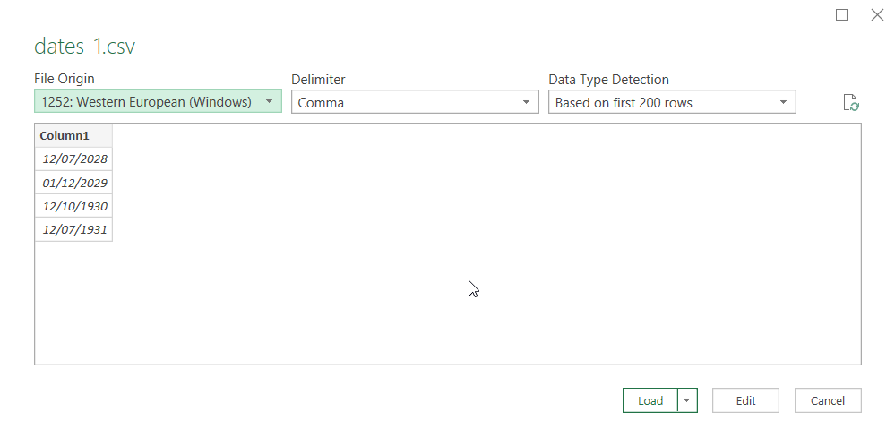
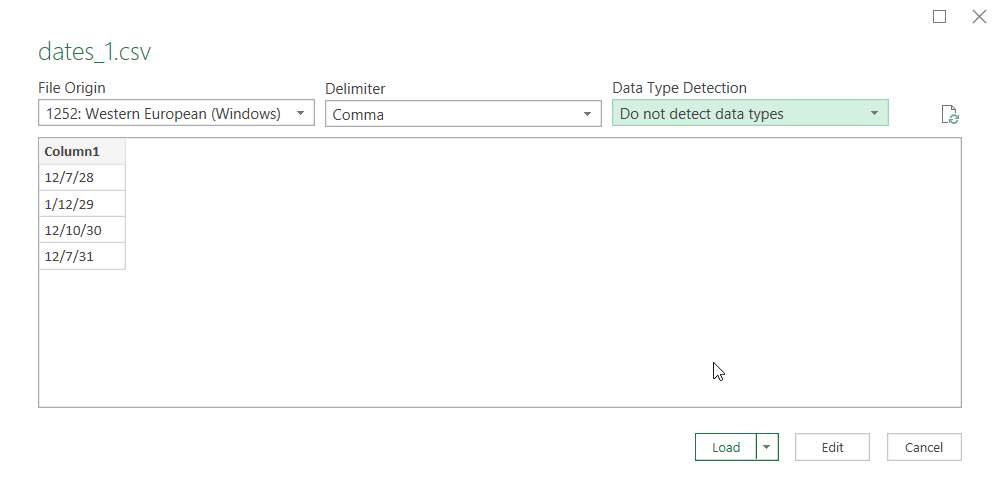
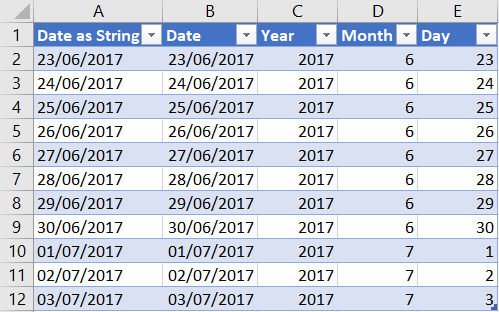
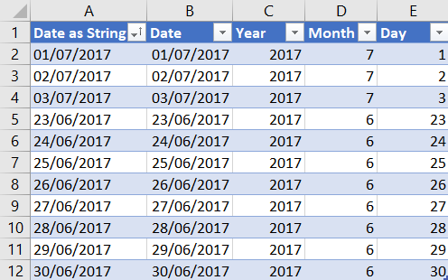
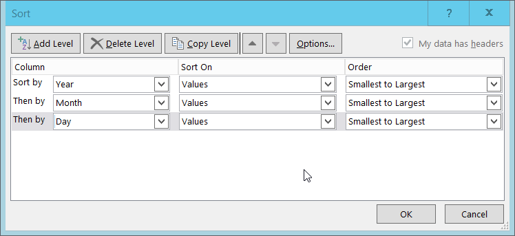

## Storing dates in a spreadsheet

When you enter a date into a spreadsheet it looks like a date although the spreadsheet may perform some slight reformatting of what you actually typed. For example if I enter '7/12/88' into my UK version of Excel it is displayed as '07/12/1988'. These are slightly different representations of the same date.

I made it clear that it was a UK version of Excel because different countries write dates differently. In the UK '7/12/88' represents the 7th of December 1988 whereas in the USA it would be read as the 12th of July 1988.

This regional variation is handled automatically by the spreadsheet program so that when you are typing in dates they appear as you would expect. If you try to type in a US format date into a UK version of Excel, it may or may not be treated as a date.

> ## Exercise
> 
> Type the following 'Dates' into three adjacent cells in an Excel spreadsheet; '13/06/88', '07/05/88' and '06/13/88'
> 
> 1. Which ones have been interpreted as dates?
> 2. How can you tell?
> 3. What kind of problems can be caused by dates not being interpreted correctly?
> 
> > ## Solution
> > 
> > 1. This will depend on your local version of Excel. For the UK the first 2 will be treated as dates and in the US the last two will be treated as dates.
> > 2. You can tell if Excel has treated your input as a date in these cases as it will change the '88' to '1988' for dates. For the one that isn't recognised as a date it is assumed to be a string of characters with no specific meaning.
> > 3. If the input is is not recognised as a date it will be left as a string. This means that any date related operations you try to perform on this input is likely to fail. A simple example would be sorting. If you sort a list of dates they will appear in chronological date order. If you sort a list of strings, which just look like dates then the sorted list will be very different.
> {: .solution}
{: .challenge}

The more dangerous problem, because it could be harder to spot, is when the input is interpreted as a date, but the wrong date. The date '07/05/88' might be interpreted as the 7th of May or the 5th of July depending on the version of Excel.

This problem is most likely to arise if you are importing data from a file in text format, like from a .csv file. If the dates in the file were written assuming a particular format for dates and then read into an Excel version expecting a different format, then the dates will be given the wrong values internally. 

## Internal representation of Dates in a spreadsheet.

What do we mean when we say that a date will be given the wrong value internally? 

We have already noted that when you type in a date, Excel may re-format what you type, but what is displayed still looks like a recognisable date. Internally however once Excel has decided that what you typed is a date it is stored as simple number. What Excel displays in the cell is for your convenience.

This can be demonstrated as follows

> ## Exercise
> 
> 1. Type a valid date in your local date format into a cell. 
> 2. Select the cell, right mouse click and select Format cells...
> 3. In the Format Cells window change the category from date to General and click OK
> 4. Your date is now displayed as a number.
> 5. Reverse the process to change the display back to a recognisable date
{: .challenge}

Storing dates as numbers is quite convenient for the spreadsheet program as it allows simple date arithmetic to be performed easily. If you subtract one date from another, you get the number of days difference between them. If you add 10 to a date you get the date 10 days after the original date.

## Dates Excel doesn't recognise

If Excel treats dates as as numbers, which date is number 1 and what happens if you want a date before that?

You can use the technique used in the previous exercise to to answer the first part of this question. It turns out that the number 1 equates to a date 0f 01/01/1900. If you subtract 1 from this date, Excel returns 00/01/1900 which is not a real date at all. If you were to subtract 2 Excel returns '########' and a message saying that it cannot deal with negative dates. 

This will clearly create problems if you need to use data including historical dates.

## Dates Excel gets wrong

There is a further problem. If I type in a date of '6/6/29', Excel treats this as '06/06/2029', but '6/6/30' is treated as '06/06/1930'. If I am typing I always have the option of using four digits for the year to avoid this particular problem, but I might forget. If I am reading data from a file which only has two digit years then you will need to be able to specify that any date columns should be read as text. 

In most cases to load a csv file into Excel, you can just double-click the filename in file explorer. Unfortunately when you do this, Excel will automatically treat any column which appears to have dates in it as a date column. This is not always what we want. 

To give us more control over how Excel interprets our data, we need to explicitly load the csv file into Excel.
For this exercise we will use the dates_1.csv file which you can download from [here](../data/dates_1.csv). Store it anywhere you like on your Laptop.

1. Open an empty Excel workbook. 
2. From the data ribbon, select 'From Text/CSV' from the 'Get & Transform data' section
3. Navigate to and select the required file (dates_1.csv) from the File Open dialog. 
4. In the data load dialog, the first few rows of your data is shown. On the Right hand side above the data pane there is a drop-down box which labelled 'Data Type Detection'. The default value for this is 'Based on first 200 rows'. The first (only) column of our small dataset contains valid dates with 2 digit years. You can see that some have been interpreted as 20th century dates and some as 21st century dates.

5. If we change the 'Data Type Detection' option to 'Do not detect data types' then our 'dates' remain as they are with 2 digit centuries and will be imported (click load) as text into the spreadsheet.

 
 
## Breaking down dates into components

Because of the potential problems with interpreting dates, it can be easier to represent dates as separate components for year month and day. Then all dates are represented by three un-ambiguous numbers. This does make data arithmetic more difficult, but you can still sort the date fields by using a multi level sort.

Excel does provide a set of functions which allow parts of dates to be extracted

> ## Exercise 
> 
> 1. open a blank excel workbook and type any valid date in any valid format in to cell A1.
> 2. In adjacent cells type '=Year(A1)', 'Month(A1)' and 'Day(A1)'
> 3. When you get to the point of typing the '(' in each case, what does the pop-up help tip say?
> 
> > ## Solution
> > 
> > In each case the function returns the required part of the date as a number.
> > The pop-up tip suggests that the single required parameter is a number, which is what is in A1 despite you seeing it as a formatted date.
> > 
> {: .solution}
{: .challenge}
 

In the spreadsheet segment above, the dates were entered into the Date column. 
All of the other columns have been populated using formulas which make use of the Date column values.
Using the date in cell B2 as an example. The other column values in row 2 have been created using the following formulas

| column name | Formula used |
|-------------|:-----------------|
|Year         | =Year(B2) |
| Month       | =Month(B2) |
| Day         | =Day(B2)  |
|Date as String | = Text(B2, "dd/mm/yyyy") |

The rows are in chronological date order

If I sort the table using the 'Date as string' column, it looks like this.

You can see that as the character '0' comes before the character '2' in the text collating sequence, the dates are no longer in order.

Instead of sorting on the Date column we can sort on the Year, Month and Day columns. (Select Sort from the Data toolbar)

This will return the table to chronological order. 

An alternative would be to represent the date as a year and the number of days into that year. 

